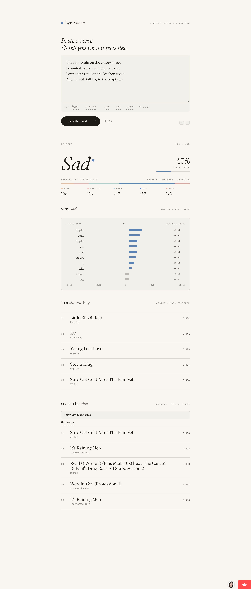
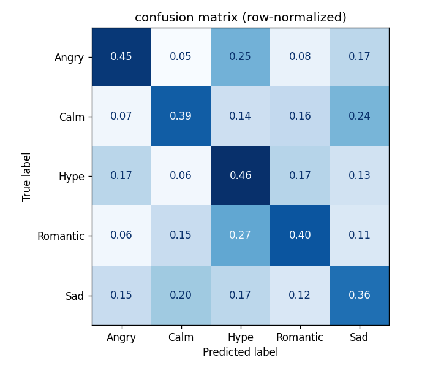
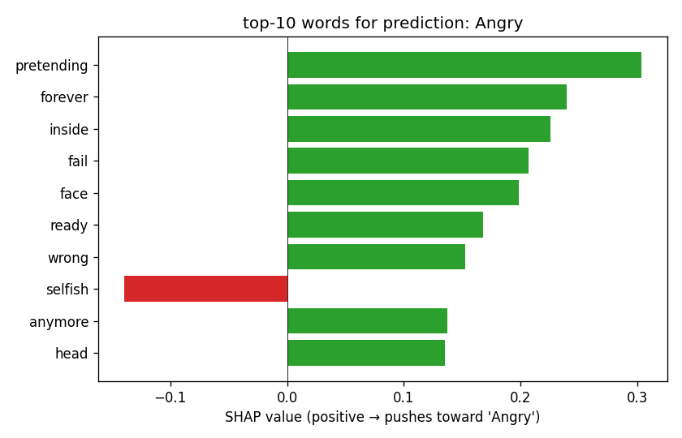

# LyricMood

[](https://github.com/evelindsayyy/lyrics_mood_predictor/actions/workflows/ci.yml)
[](https://lyricsmoodpredictor-zrtbnhzdwavalcsqriyexb.streamlit.app/)
[](requirements-api.txt)
[](tests/)

Paste song lyrics, get the mood — _and why_ — plus five songs that feel the same. A two-model ML system (interpretable baseline + fine-tuned transformer) served behind one FastAPI, with a Streamlit UI as a thin client. Started as an ML course project; rebuilt over four spec-driven weeks into a production-style system with vector search, CI, and a hosted demo.

**[Live demo →](https://lyricsmoodpredictor-zrtbnhzdwavalcsqriyexb.streamlit.app/)** _(free tier — first visit after a quiet week takes ~2 min to wake)_

<p align="center">
  <a href="https://lyricsmoodpredictor-zrtbnhzdwavalcsqriyexb.streamlit.app/">
    
  </a>
</p>

## What it Does

LyricMood answers three kinds of query over a shared song corpus, all through one HTTP API:

1. **Predict a mood from pasted lyrics** — one of _Hype, Romantic, Calm, Sad, Angry_, with a confidence score and a **word-level SHAP explanation** (the top words that pushed the model toward, or away from, its call), so the model isn't a black box.
2. **Search the corpus by free-text vibe** — e.g. `rainy late night drive` — and get back the songs whose lyrics sit closest in embedding space.
3. **Find similar songs** — paste lyrics (or look one up by title) and get five songs with a matching emotional profile.

Two models serve the mood prediction behind the same endpoint, selectable per request: a **TF-IDF + logistic-regression baseline** (fast, exactly explainable) and a **fine-tuned DistilBERT** exported to int8 ONNX (higher accuracy, torch-free serving). The **Streamlit UI is a pure API client** — zero ML imports; it just renders what the API returns.

Mood labels are derived, not annotated: they come from Spotify's audio features (valence + energy, cut into regions of [Russell's circumplex model](#research-connections)), so the model learns which lyrical patterns go with which audio-derived moods.

## Tech Stack

| layer                   | tech                                                                                                                                                       |
| ----------------------- | ---------------------------------------------------------------------------------------------------------------------------------------------------------- |
| **Serving**             | FastAPI · Pydantic v2 · uvicorn · **onnxruntime** — all inference is torch-free int8/fp32 ONNX on CPU                                                       |
| **Models**              | scikit-learn (TF-IDF + logistic regression) · **DistilBERT** fine-tuned with PyTorch on a Colab T4, exported to int8 ONNX · **SHAP** explanations           |
| **Retrieval**           | **Qdrant** vector DB (76,595 songs) · MiniLM sentence embeddings via a parity-checked ONNX export                                                            |
| **UI**                  | Streamlit as a pure API client (httpx; zero ML imports)                                                                                                     |
| **Ops & quality**       | Docker Compose · **GitHub Actions CI** (lint + 106-test pytest suite + image builds) · Prometheus `/metrics` · slowapi rate limiting · structlog · ruff     |
| **Training & tracking** | MLflow experiment tracking · frozen-split eval harness with a quality gate (`training/evaluate.py`)                                                          |

## Architecture

Two lanes: an **offline** lane that trains models and indexes the corpus, and an **online** serving lane that answers queries. Everything served is **torch-free** — the transformer and the query embedder both run on `onnxruntime` (CPU), so the API image stays small.

```
  OFFLINE (train + index)                     ONLINE (serve)
  ─────────────────────────                   ─────────────────────────────────

  notebooks/ + Colab                          browser
    │  TF-IDF+LR, DistilBERT                     │  http
    │  fine-tune (T4)                            ▼
    ▼                                          ui  ── Streamlit :8501 (pure API client)
  artifacts                                       │  LYRICMOOD_API_URL
    ├─ best_classifier.pkl                        ▼
    ├─ tfidf_vectorizer.pkl                    api ── FastAPI :8000
    ├─ transformer/  (ONNX int8)                  │   ├─ registry.json → baseline | transformer
    ├─ embedder/     (ONNX MiniLM,                │   │      (?model= selects per request)
    │                 parity-checked)             │   ├─ query embedder (ONNX MiniLM, torch-free)
    └─ corpus_embeddings.npy                      │   ├─ SHAP explain (baseline: exact LinearExplainer)
         │                                        ▼   └─ rate limit + /metrics + error envelope
         ▼  scripts/index_corpus.py            qdrant ── vector search :6333
       qdrant collection ◄───────────────────────┘   (excerpt payloads, mood filter)
```

- **`models/registry.json`** pins which models are loaded and which is default; `POST /v1/predict?model=baseline|transformer` picks one per request (`400 unknown_model` / `503 model_unavailable`).
- The **query embedder** is a parity-checked ONNX export of `all-MiniLM-L6-v2` — masked mean-pooling + L2-normalization reimplemented in numpy so query vectors land in the same space as the corpus embeddings (checked against the original sentence-transformers model before it's trusted).
- The API never logs raw lyrics; every error is a `{"error": {code, message}}` envelope.

Deeper rationale for the two-pipeline split is in [`docs/architecture.md`](docs/architecture.md); the full industrial-elevation design is in [`docs/superpowers/specs/2026-07-09-industrial-elevation-design.md`](docs/superpowers/specs/2026-07-09-industrial-elevation-design.md).

## API

All endpoints are under `/v1` except `/health` and `/metrics`. Error responses use `{"error": {code, message}}`.

| endpoint           | what it does                                                                              | example                                                                                                         |
| ------------------ | ----------------------------------------------------------------------------------------- | --------------------------------------------------------------------------------------------------------------- |
| `POST /v1/predict` | lyrics → mood + confidence + SHAP words (`?model=baseline\|transformer`)                  | `curl -X POST localhost:8000/v1/predict -H 'content-type: application/json' -d '{"lyrics": "..."}'`             |
| `GET /v1/search`   | free-text vibe → ranked songs                                                             | `curl "localhost:8000/v1/search?q=rainy%20late%20night%20drive"`                                                |
| `POST /v1/similar` | lyrics → 5 similar songs (mood-filtered)                                                  | `curl -X POST localhost:8000/v1/similar -H 'content-type: application/json' -d '{"lyrics": "...", "limit": 5}'` |
| `GET /v1/songs`    | title/artist lookup → full mood analysis + similar (or candidate list on ambiguous match) | `curl "localhost:8000/v1/songs?title=midnight"`                                                                 |
| `GET /health`      | liveness / readiness                                                                      | `curl localhost:8000/health`                                                                                    |
| `GET /metrics`     | Prometheus counters + histograms per route                                                | `curl localhost:8000/metrics`                                                                                   |

Rate limiting is 30 req/min/IP (`429` + `Retry-After`); `/health` and `/metrics` are exempt.

## Quick Start

```bash
# 1. env
python3 -m venv .venv && source .venv/bin/activate
pip install -r requirements-dev.txt      # api + test deps (the ui runs in its own container)

# 2. artifacts (see SETUP.md for the full walkthrough)
#    - download SpotGenTrack, run notebooks/01_eda.ipynb → data/processed/songs_labeled.csv
#    - run notebooks/02_modeling.ipynb → models/best_classifier.pkl + tfidf_vectorizer.pkl
#    - one-liner (SETUP.md step 5) → models/corpus_embeddings.npy
#    - python scripts/export_minilm_onnx.py → models/embedder/  (query embedder)

# 3. run the full stack (ui + api + vector db)
docker compose up --build          # ui :8501, api :8000, qdrant :6333
python scripts/index_corpus.py     # one-time corpus indexing into qdrant

# then open http://localhost:8501, or hit the API directly —
curl -X POST localhost:8000/v1/predict -H 'content-type: application/json' -d '{"lyrics": "..."}'
curl "localhost:8000/v1/search?q=rainy%20late%20night%20drive"
```

To run the API without Docker: `uvicorn api.main:app --reload` (needs local `models/` + a reachable Qdrant). Full step-by-step setup is in [SETUP.md](SETUP.md).

## Evaluation

### Baseline vs. fine-tuned transformer

Two models serve behind the same API (`POST /v1/predict?model=baseline|transformer`), scored on the identical frozen test split (n=7,660) by `training/evaluate.py` — full reports in [`results/eval_baseline.md`](results/eval_baseline.md) and [`results/eval_transformer.md`](results/eval_transformer.md):

| model                                         | test accuracy | test macro F1 | serving                     | explanations                           |
| --------------------------------------------- | ------------- | ------------- | --------------------------- | -------------------------------------- |
| TF-IDF + logistic regression (baseline)       | 0.432         | 0.371         | sklearn, ~ms                | exact SHAP (`LinearExplainer`)         |
| **DistilBERT fine-tune, ONNX int8 (default)** | **0.521**     | **0.395**     | onnxruntime CPU, torch-free | approximate SHAP (Text masker, capped) |

The transformer (2 epochs on a free Colab T4, class-weighted loss, early-stopped on val macro F1 = 0.408) wins on both headline metrics — most of the gain is Hype recall (0.46 → 0.68) and Sad, at the cost of some Calm recall (0.39 → 0.22). Both models remain served: the baseline is kept as the fast, exactly-explainable option, and the accuracy↔explainability trade-off is deliberate. The remaining ceiling is label noise from valence/energy thresholding, not model capacity — see the error analysis below.

Baseline recipe: logistic regression (C=1.0, L2, `class_weight='balanced'`) on TF-IDF features (unigrams + bigrams, 20k vocab cap, min_df=3, sublinear_tf). The first-pass sweep of 7 configs (4 LR × 3 MultinomialNB) is in [notebooks/02_modeling.ipynb](notebooks/02_modeling.ipynb); a second-pass tuning of the TF-IDF knobs is in [notebooks/03_evaluation.ipynb](notebooks/03_evaluation.ipynb). Baseline detail:

| metric              | value                                                     | notes                                           |
| ------------------- | --------------------------------------------------------- | ----------------------------------------------- |
| test accuracy       | 0.432                                                     | vs. 0.546 majority-class baseline               |
| test macro F1       | 0.371                                                     | vs. 0.141 majority-class, 0.201 random-weighted |
| per-class precision | Hype 0.73, Sad 0.33, Calm 0.27, Romantic 0.26, Angry 0.23 |                                                 |
| per-class recall    | Angry 0.45, Hype 0.46, Romantic 0.40, Calm 0.39, Sad 0.36 |                                                 |

Macro F1 is the right metric here because Hype is ~55% of the corpus — overall accuracy is easy to game by just predicting Hype. The model beats the majority-class baseline's macro F1 by a factor of 2.5×.

Error analysis in [notebooks/03_evaluation.ipynb](notebooks/03_evaluation.ipynb) shows most residual errors cluster in three mood pairs (Romantic↔Hype, Angry↔Hype, Sad↔Calm) and are driven by shared genre vocabulary plus label noise from the valence-energy thresholding — not by the classifier itself being broken.

### Each project objective has a quantitative metric

| objective                                                                      | metric                                                              | result                                                                     |
| ------------------------------------------------------------------------------ | ------------------------------------------------------------------- | -------------------------------------------------------------------------- |
| Predict mood from lyrics                                                       | test accuracy / macro F1                                            | 0.432 / 0.371 (vs. 0.546 / 0.141 majority-class)                           |
| SHAP explanations are _faithful_ (not decorative)                              | mean confidence drop when top-5 SHAP words deleted; class-flip rate | 0.098 mean drop; 62/100 class flips on 100 correctly-classified test songs |
| MiniLM retrieval carries mood signal independently of the explicit mood filter | unfiltered mood-match precision@5 vs. random baseline               | 0.478 vs. 0.354 random — **1.35× lift** on 200 corpus queries              |

Full derivations in the _evaluation directly tied to project objectives_ section of [notebooks/03_evaluation.ipynb](notebooks/03_evaluation.ipynb).

### Sample outputs

**Confusion matrix (test set, row-normalized):**



The diagonal shows per-class recall. Brightest off-diagonal cells (Romantic→Hype, Angry→Hype, Calm↔Sad) are mood pairs that share lyrical vocabulary — analyzed in detail in `notebooks/03_evaluation.ipynb`.

**SHAP explanation for an Angry prediction:**



Green bars = words pushing toward the predicted mood; red = pushing away. The model exposes its own reasoning, so a user can sanity-check whether a prediction is being driven by sensible vocabulary or noise.

## From Class Project to Production System

LyricMood started as a single-file Streamlit app that loaded pickles in-process. Over four one-week increments it became a service. Each step is a spec-driven change ([design spec](docs/superpowers/specs/2026-07-09-industrial-elevation-design.md), [weekly plans](docs/superpowers/plans/)):

- **Start (class submission)** — notebooks (EDA → modeling → evaluation), a TF-IDF+LR baseline with exact SHAP, MiniLM cosine retrieval, and a Streamlit app that imported the models directly.
- **Week 1 — API spine** ([plan](docs/superpowers/plans/2026-07-09-week1-api-spine.md)): extracted a dockerized FastAPI service (`POST /v1/predict`) with an error-envelope contract, health endpoint, structured logging that never logs raw lyrics, a test suite, and an idempotent Qdrant corpus indexer.
- **Week 2 — transformer + multi-model serving** ([plan](docs/superpowers/plans/2026-07-10-week2-transformer.md)): fine-tuned DistilBERT on Colab, exported to int8 ONNX, and served it torch-free through the same `MoodModel` protocol — registry-driven so `?model=` swaps models per request — plus an eval harness with a quality gate against the majority-class baseline.
- **Week 3 — real queries + UI as client** ([plan](docs/superpowers/plans/2026-07-10-week3-real-queries.md)): added `GET /v1/search`, `POST /v1/similar`, and `GET /v1/songs` backed by a parity-checked ONNX MiniLM query embedder; slowapi rate limiting; a Prometheus `/metrics` endpoint; and a Streamlit rewrite into a pure API client, giving a three-container Compose stack (ui + api + qdrant).
- **Week 4 — ship it** ([plan](docs/superpowers/plans/2026-07-11-week4-ship-it.md)): CI on every push (lint + 106-test suite + Docker build), a free-hosted demo on Streamlit Community Cloud (`demo_entry.py` runs the API in-process + downloads the model bundle from a HF model repo, see [`docs/DEPLOY_DEMO.md`](docs/DEPLOY_DEMO.md); the single-container `Dockerfile.spaces` stays as the paid-tier/self-host option), and this README.
- **Future work** — LLM-assisted relabeling to reduce the valence/energy label noise that currently caps accuracy: re-derive mood labels from the lyrics themselves instead of audio-feature thresholds, and re-measure both models on the cleaner labels.

## Video Links

Both videos are stored in this repository under [`videos/`](videos/) and also linked below for direct viewing.

- **Project Demo** (3–5 min, non-technical): [`videos/demo.mp4`](videos/demo.mp4) · [YouTube](https://youtu.be/YAT78qsMW6o)
- **Technical Walkthrough** (5–10 min): [`videos/walkthrough.mp4`](videos/walkthrough.mp4) · [YouTube](https://youtu.be/saAWmiuv8NY)

## Research Connections

This project leans on three pieces of prior work:

- **Russell, J. A. (1980). _A circumplex model of affect._** _Journal of Personality and Social Psychology, 39(6), 1161–1178._ — Motivates the 2-D valence/energy mood space. The 5 mood labels (Hype, Romantic, Calm, Sad, Angry) are named regions in Russell's circumplex, cut by thresholding Spotify's `valence` and `energy` scalars.
- **Hu, X., & Downie, J. S. (2010). _When lyrics outperform audio for music mood classification: A feature analysis._** _Proceedings of ISMIR 2010._ — Shows lyric-derived features can beat audio features on mood classification. Motivates using lyrics (not audio features) as the model input, while letting audio features serve only as label proxies.
- **Reimers, N., & Gurevych, I. (2019). _Sentence-BERT: Sentence embeddings using Siamese BERT-networks._** _Proceedings of EMNLP 2019._ — Sentence-transformer architecture used for the retrieval half of the app. Specifically I use the pretrained `all-MiniLM-L6-v2` model, which outputs 384-d vectors cheap enough to index the full ~80k-song corpus.

## Individual Contributions

This is a **solo project** — all design, implementation, analysis, and writing was done by me. There were no other contributors.

Specifically, I was responsible for:

- **Project planning & ML design** — the rubric mapping (see [docs/rubric-mapping.md](docs/rubric-mapping.md)), the 5-mood taxonomy, valence/energy threshold values, the gap-zone filter, the choice of TF-IDF + Logistic Regression for classification (so SHAP `LinearExplainer` can run exactly), and MiniLM for retrieval (semantic similarity).
- **Implementation** — every `src/` module (`preprocess.py`, `features.py`, `classify.py`, `recommend.py`, `explain.py`), all three Jupyter notebooks, and the Streamlit app.
- **Hyperparameter selection** — `C=1.0`, `class_weight='balanced'`, `ngram_range=(1,2)`, `max_features=20000`, `min_df=3`, `sublinear_tf=True`.
- **Analysis & writing** — the error-analysis discussion in `03_evaluation.ipynb`, the edge-case interpretation, the improvement-iteration writeup, and all the project documentation (this README, `SETUP.md`, `ATTRIBUTION.md`).
- **Frontend visual design** — `docs/design/LyricMood Minimal.html`, `app/static/lyricmood.css`, the design tokens (palette, fonts, spacing).

AI-tool usage (Claude) is documented separately and in detail in [ATTRIBUTION.md](ATTRIBUTION.md).

## More Documentation

Additional documentation lives in [`docs/`](docs/):

- [`docs/architecture.md`](docs/architecture.md) — system architecture diagram and the rationale for the two-pipeline split (TF-IDF for classification, MiniLM for retrieval).
- [`docs/DEPLOY_DEMO.md`](docs/DEPLOY_DEMO.md) — runbook for deploying the free demo to Streamlit Community Cloud (`demo_entry.py` in-process API + HF-model-repo bundle download); notes the `Dockerfile.spaces` single-container image as the paid-tier/self-host alternative.
- [`docs/rubric-mapping.md`](docs/rubric-mapping.md) — maps each ML rubric checkbox to the file or notebook section that earns it. Useful for a quick grading pass.
- [`docs/findings.md`](docs/findings.md) — known limitations and data-quality artifacts (duplicate lyrics in SpotGenTrack, stand-up comedy in the Sad class, the non-Latin-script `clean_text` limitation).
- [`docs/superpowers/`](docs/superpowers/) — the industrial-elevation design spec and the four weekly implementation plans.

## Repo Structure

```
LyricsMoodPredictor/
├── demo_entry.py                 # Streamlit Community Cloud entrypoint (in-process API + bundle download)
├── requirements-demo.txt         # SCC demo deps (API + UI + huggingface_hub); becomes root requirements.txt on the `demo` branch
├── app/streamlit_app.py          # Streamlit UI (pure API client, zero ML imports)
├── api/                          # FastAPI service
│   ├── main.py                   # create_app() factory, lifespan artifact loading
│   ├── config.py schemas.py errors.py deps.py   # settings, DTOs, error envelope, DI
│   ├── ratelimit.py metrics.py logging_setup.py # rate limiting, Prometheus, no-raw-lyrics logging
│   ├── routes/                   # health, predict, search, songs
│   └── services/                 # model, transformer, registry, embedder, retrieval, songs
├── src/
│   ├── preprocess.py             # text cleaning, mood labels, gap-zone filter
│   ├── features.py               # TF-IDF vectorizer (classification)
│   ├── classify.py               # split + train + evaluate helpers
│   ├── recommend.py              # MiniLM embeddings + cosine-sim retrieval
│   └── explain.py                # SHAP LinearExplainer wrapper
├── training/                     # transformer fine-tune + eval harness
│   ├── finetune_distilbert.py    # Colab-targeted fine-tune → int8 ONNX
│   └── evaluate.py               # frozen-split eval, quality gate, markdown report
├── scripts/
│   ├── index_corpus.py           # idempotent Qdrant corpus indexer
│   ├── export_minilm_onnx.py     # parity-checked ONNX query-embedder export
│   └── build_demo_bundle.py      # assemble the demo bundle (demo/) for the HF model repo
├── notebooks/
│   ├── 01_eda.ipynb              # EDA + preprocessing experiments
│   ├── 02_modeling.ipynb         # baselines, sweep, best model
│   └── 03_evaluation.ipynb       # error analysis, edge cases, iterations, objective metrics
├── tests/                        # 106-test pytest suite (unit + api, artifact-free)
├── docker/                       # Dockerfile.api, Dockerfile.ui, Dockerfile.spaces, spaces_launcher.sh
├── .github/workflows/ci.yml      # lint + test + docker-build
├── docs/
│   ├── architecture.md           # system architecture + design decisions
│   ├── DEPLOY_DEMO.md            # Streamlit Community Cloud deploy runbook
│   ├── rubric-mapping.md         # rubric items → evidence locations
│   ├── findings.md               # known limitations + data-quality findings
│   ├── superpowers/              # design spec + weekly implementation plans
│   └── design/                   # frontend visual mock + design handoff
├── videos/                       # demo.mp4 + walkthrough.mp4
├── data/processed/               # generated (songs_labeled.csv, gitignored)
├── models/                       # generated (pickles, ONNX, embeddings, registry.json; gitignored)
├── results/                      # generated figures + eval reports
├── README.md SETUP.md ATTRIBUTION.md CLAUDE.md
└── requirements*.txt             # runtime (api/ui), dev, and train deps
```
